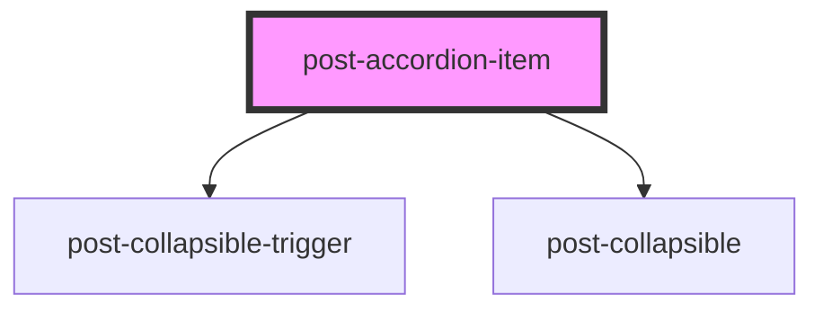

# post-accordion-item

<!-- Auto Generated Below -->

## Properties

| Property       | Attribute       | Description                                                                                                                                                                                                                  | Type                         | Default     |
| -------------- | --------------- | ---------------------------------------------------------------------------------------------------------------------------------------------------------------------------------------------------------------------------- | ---------------------------- | ----------- |
| `collapsed`    | `collapsed`     | If `true`, the element is collapsed otherwise it is displayed.                                                                                                                                                               | `boolean`                    | `false`     |
| `headingLevel` | `heading-level` | **[DEPRECATED]** set the `heading-level` property on the parent `post-accordion` instead.  Defines the hierarchical level of the accordion item header within the headings structure. | `1 \| 2 \| 3 \| 4 \| 5 \| 6` | `undefined` |

## Methods

### `toggle(force?: boolean) => Promise<boolean>`

Triggers the collapse programmatically.

#### Parameters

| Name    | Type      | Description |
| ------- | --------- | ----------- |
| `force` | `boolean` |             |

#### Returns

Type: `Promise<boolean>`

## Slots

| Slot        | Description                                                         |
| ----------- | ------------------------------------------------------------------- |
| `"default"` | Slot for placing content within the accordion item's body.          |
| `"header"`  | Slot for placing custom content within the accordion item's header. |

## Shadow Parts

| Part               | Description |
| ------------------ | ----------- |
| `"accordion-item"` |             |

## Dependencies

### Depends on

- [post-collapsible-trigger](../post-collapsible-trigger)
- [post-collapsible](../post-collapsible)

### Graph

----------------------------------------------

*Built with [StencilJS](https://stenciljs.com/)*
