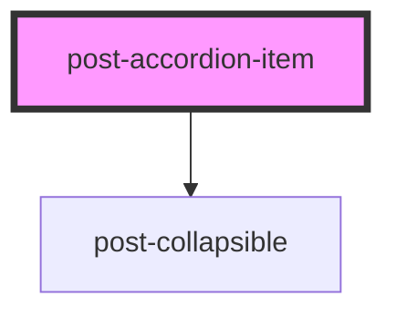

# post-accordion-item

<!-- Auto Generated Below -->

## Properties

| Property       | Attribute       | Description                                                                                | Type                         | Default |
| -------------- | --------------- | ------------------------------------------------------------------------------------------ | ---------------------------- | ------- |
| `collapsed`    | `collapsed`     | If `true`, the element is initially collapsed otherwise it is displayed.                   | `boolean`                    | `false` |
| `headingLevel` | `heading-level` | Defines the hierarchical level of the accordion item header within the headings structure. | `1 \| 2 \| 3 \| 4 \| 5 \| 6` | `2`     |

## Methods

### `toggle(force?: boolean) => Promise<boolean>`

Triggers the collapse programmatically.

#### Returns

Type: `Promise<boolean>`

## Shadow Parts

| Part               | Description |
| ------------------ | ----------- |
| `"accordion-item"` |             |

## Dependencies

### Depends on

- [post-collapsible](../post-collapsible)

### Graph

----------------------------------------------

*Built with [StencilJS](https://stenciljs.com/)*
