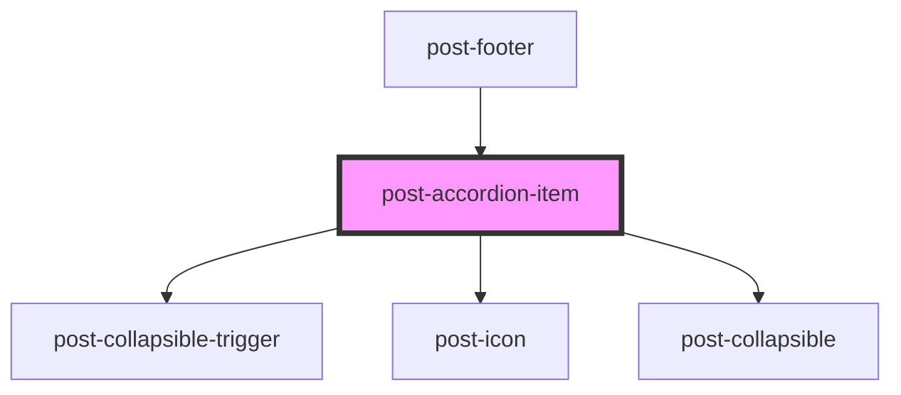

# post-accordion-item

<!-- Auto Generated Below -->

## Properties

| Property    | Attribute   | Description                                                    | Type      | Default |
| ----------- | ----------- | -------------------------------------------------------------- | --------- | ------- |
| `collapsed` | `collapsed` | If `true`, the element is collapsed otherwise it is displayed. | `boolean` | `false` |

## Methods

### `toggle(force?: boolean) => Promise<boolean>`

Triggers the collapse programmatically.

#### Parameters

| Name    | Type      | Description |
| ------- | --------- | ----------- |
| `force` | `boolean` |             |

#### Returns

Type: `Promise<boolean>`

## Slots

| Slot        | Description                                                                 |
| ----------- | --------------------------------------------------------------------------- |
| `"default"` | Slot for placing content within the accordion item's body.                  |
| `"header"`  | Slot for placing custom content within the accordion item's header.         |
| `"logo"`    | Slot for placing a logo in the accordion item’s header, before the content. |

## Shadow Parts

| Part                      | Description                                                  |
| ------------------------- | ------------------------------------------------------------ |
| `"post-accordion-body"`   | The element that holds the accordion item's content.         |
| `"post-accordion-button"` | The element that toggles the accordion item (header button). |

## Dependencies

### Used by

 - [post-footer](../post-footer)

### Depends on

- [post-collapsible-trigger](../post-collapsible-trigger)
- [post-icon](../post-icon)
- [post-collapsible](../post-collapsible)

### Graph

```mermaid
graph TD;
  post-accordion-item --> post-collapsible-trigger
  post-accordion-item --> post-icon
  post-accordion-item --> post-collapsible
  post-footer --> post-accordion-item
  style post-accordion-item fill:#f9f,stroke:#333,stroke-width:4px
```

----------------------------------------------

*Built with [StencilJS](https://stenciljs.com/)*
