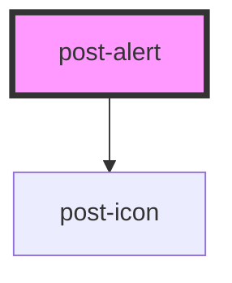

# post-alert

<!-- Auto Generated Below -->

## Properties

| Property       | Attribute       | Description                                                                                                         | Type                                                                  | Default     |
| -------------- | --------------- | ------------------------------------------------------------------------------------------------------------------- | --------------------------------------------------------------------- | ----------- |
| `dismissLabel` | `dismiss-label` | The label to use for the close button of a dismissible alert.                                                       | `string`                                                              | `undefined` |
| `dismissible`  | `dismissible`   | If `true`, a close button (×) is displayed and the alert can be dismissed by the user.                              | `boolean`                                                             | `false`     |
| `fixed`        | `fixed`         | If `true`, the alert is positioned at the bottom of the window, from edge to edge.                                  | `boolean`                                                             | `false`     |
| `icon`         | `icon`          | The icon to display in the alert. By default, the icon depends on the alert type.  If `none`, no icon is displayed. | `string`                                                              | `undefined` |
| `type`         | `type`          | The type of the alert.                                                                                              | `"danger" \| "gray" \| "info" \| "primary" \| "success" \| "warning"` | `'primary'` |

## Events

| Event           | Description                                                                                                                             | Type                |
| --------------- | --------------------------------------------------------------------------------------------------------------------------------------- | ------------------- |
| `postDismissed` | An event emitted when the alert element is dismissed, after the transition. It has no payload and only relevant for dismissible alerts. | `CustomEvent<void>` |

## Methods

### `dismiss() => Promise<void>`

Triggers alert dismissal programmatically (same as clicking on the close button (×)).

#### Returns

Type: `Promise<void>`

## Slots

| Slot        | Description                                                              |
| ----------- | ------------------------------------------------------------------------ |
| `"actions"` | Slot for placing custom actions (buttons, links, etc.) within the alert. |
| `"default"` | Slot for placing the main content/message of the alert.                  |
| `"heading"` | Slot for placing custom content within the alert's heading.              |

## Dependencies

### Depends on

- [post-icon](../post-icon)

### Graph

----------------------------------------------

*Built with [StencilJS](https://stenciljs.com/)*
