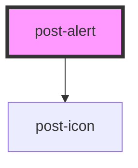

# post-alert

<!-- Auto Generated Below -->

## Properties

| Property       | Attribute       | Description                                                                                                                     | Type                | Default     |
| -------------- | --------------- | ------------------------------------------------------------------------------------------------------------------------------- | ------------------- | ----------- |
| `dismissLabel` | `dismiss-label` | The label to use for the close button of a dismissible alert.                                                                   | `string`            | `undefined` |
| `dismissible`  | `dismissible`   | If `true`, a close button (×) is displayed and the alert can be dismissed by the user.                                          | `boolean`           | `false`     |
| `fixed`        | `fixed`         | If `true`, the alert is positioned at the bottom of the window, from edge to edge.                                              | `boolean`           | `false`     |
| `icon`         | `icon`          | The icon to display in the alert.  If `true`, the icon depends on the alert type. If `false`, no icon is displayed.             | `boolean \| string` | `true`      |
| `type`         | `type`          | The type of the alert.  We provide styles for the following types: `'primary'`, `'success'`, `'danger'`, `'warning'`, `'info'`. | `string`            | `'primary'` |

## Methods

### `close() => Promise<void>`

Triggers alert closing programmatically (same as clicking on the close button (×)).

#### Returns

Type: `Promise<void>`

## Dependencies

### Depends on

- [post-icon](../post-icon)

### Graph

----------------------------------------------

*Built with [StencilJS](https://stenciljs.com/)*
