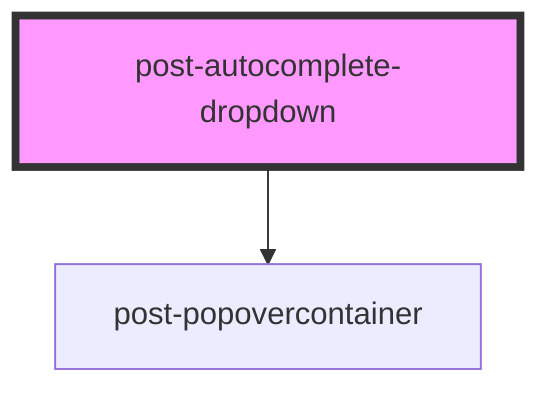

# post-autocomplete-dropdown

<!-- Auto Generated Below -->

## Methods

### `filter(term: string) => Promise<void>`

Filters options in the dropdown according to a provided search term.

#### Parameters

| Name   | Type     | Description |
| ------ | -------- | ----------- |
| `term` | `string` |             |

#### Returns

Type: `Promise<void>`

### `toggle(target: HTMLElement) => Promise<void>`

Toggles the dropdown visibility based on its current state.

#### Parameters

| Name     | Type          | Description |
| -------- | ------------- | ----------- |
| `target` | `HTMLElement` |             |

#### Returns

Type: `Promise<void>`

## Dependencies

### Depends on

- [post-popovercontainer](../post-popovercontainer)

### Graph

----------------------------------------------

*Built with [StencilJS](https://stenciljs.com/)*
