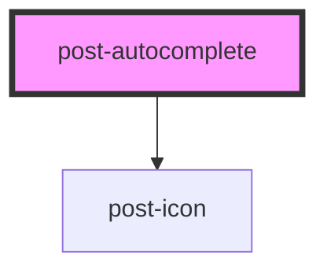

# post-autocomplete

<!-- Auto Generated Below -->

## Properties

| Property          | Attribute          | Description                                                                                                                                       | Type      | Default     |
| ----------------- | ------------------ | ------------------------------------------------------------------------------------------------------------------------------------------------- | --------- | ----------- |
| `clearable`       | `clearable`        | Show or hide the clear button.                                                                                                                    | `boolean` | `false`     |
| `filterThreshold` | `filter-threshold` | Number of characters to type before `postFilterRequest` events are fired.                                                                         | `number`  | `0`         |
| `options`         | `options`          | Optional idref to connect the autocomplete with an external `<post-listbox>`. If not provided, the component looks for a nested `<post-listbox>`. | `string`  | `undefined` |

## Events

| Event               | Description                                                                                                                                                                                                                                           | Type                  |
| ------------------- | ----------------------------------------------------------------------------------------------------------------------------------------------------------------------------------------------------------------------------------------------------- | --------------------- |
| `postFilterRequest` | A cancellable event emitted when the input value length meets the filter threshold. If `event.preventDefault()` is called, the default filtering on the listbox is skipped, allowing the user to handle filtering externally (e.g., via an API call). | `CustomEvent<string>` |

## Slots

| Slot | Description                                                                                                                                                 |
| ---- | ----------------------------------------------------------------------------------------------------------------------------------------------------------- |
|      | Default slot for the input field, label, form hints, validation messages, and an optionally nested `<post-listbox>`. All content should be direct children. |

## Dependencies

### Depends on

- [post-icon](../post-icon)

### Graph

----------------------------------------------

*Built with [StencilJS](https://stenciljs.com/)*
