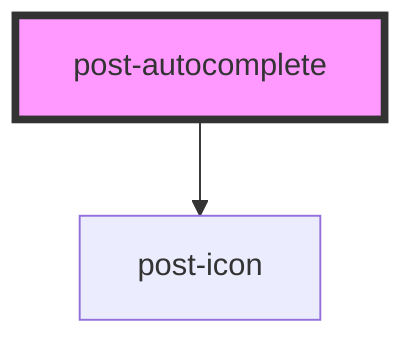

# post-autocomplete

<!-- Auto Generated Below -->

## Properties

| Property          | Attribute          | Description                                                                                                                            | Type      | Default              |
| ----------------- | ------------------ | -------------------------------------------------------------------------------------------------------------------------------------- | --------- | -------------------- |
| `clearable`       | `clearable`        | Whether to show a clear button when there is input.                                                                                    | `boolean` | `false`              |
| `disabled`        | `disabled`         | Whether the autocomplete is disabled.                                                                                                  | `boolean` | `false`              |
| `filterThreshold` | `filter-threshold` | The minimum number of characters required before filtering begins. Set to 0 to show all options immediately when the input is focused. | `number`  | `0`                  |
| `name`            | `name`             | The name of the form control, used when submitting forms.                                                                              | `string`  | `undefined`          |
| `noResultsText`   | `no-results-text`  | Message shown when no options match the filter.                                                                                        | `string`  | `'No results found'` |
| `placeholder`     | `placeholder`      | Placeholder text for the input.                                                                                                        | `string`  | `undefined`          |
| `required`        | `required`         | Whether the autocomplete is required.                                                                                                  | `boolean` | `false`              |
| `value`           | `value`            | The current value of the autocomplete.                                                                                                 | `string`  | `undefined`          |

## Events

| Event               | Description                                                                                                               | Type                                             |
| ------------------- | ------------------------------------------------------------------------------------------------------------------------- | ------------------------------------------------ |
| `postChange`        | Emitted when the value changes (an option is selected).                                                                   | `CustomEvent<{ value: string; label: string; }>` |
| `postFilterRequest` | Emitted when a filter request is made. The event is cancellable. If cancelled, the default filtering behavior is skipped. | `CustomEvent<{ query: string; }>`                |
| `postInput`         | Emitted when the input value changes (typing).                                                                            | `CustomEvent<{ value: string; }>`                |

## Methods

### `clear() => Promise<void>`

Clears the current value and input.

#### Returns

Type: `Promise<void>`

### `close() => Promise<void>`

Closes the listbox dropdown.

#### Returns

Type: `Promise<void>`

### `open() => Promise<void>`

Opens the listbox dropdown.

#### Returns

Type: `Promise<void>`

### `setFocus() => Promise<void>`

Focuses the input element.

#### Returns

Type: `Promise<void>`

## Slots

| Slot        | Description                                                                           |
| ----------- | ------------------------------------------------------------------------------------- |
| `"default"` | Content slot for input, label, hints, validation messages, and a nested post-listbox. |

## Dependencies

### Depends on

- [post-icon](../post-icon)

### Graph

```mermaid
graph TD;
  post-autocomplete --> post-icon
  style post-autocomplete fill:#f9f,stroke:#333,stroke-width:4px
```

----------------------------------------------

*Built with [StencilJS](https://stenciljs.com/)*
