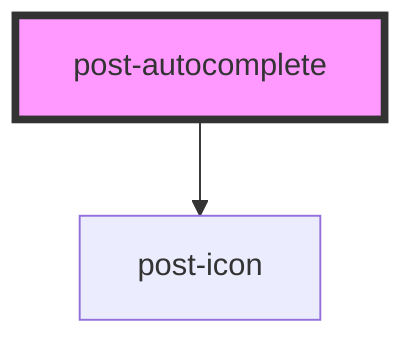

# post-autocomplete

<!-- Auto Generated Below -->

## Properties

| Property          | Attribute          | Description                                                                | Type      | Default     |
| ----------------- | ------------------ | -------------------------------------------------------------------------- | --------- | ----------- |
| `clearable`       | `clearable`        | Whether to show a clear button.                                            | `boolean` | `false`     |
| `filterThreshold` | `filter-threshold` | Number of characters to type before filter events are fired.               | `number`  | `0`         |
| `options`         | `options`          | Optional idref to connect to an external `<post-listbox>` when not nested. | `string`  | `undefined` |

## Events

| Event               | Description                                                                                                                                      | Type                                            |
| ------------------- | ------------------------------------------------------------------------------------------------------------------------------------------------ | ----------------------------------------------- |
| `postClear`         | Event fired when the autocomplete is cleared.                                                                                                    | `CustomEvent<void>`                             |
| `postFilterRequest` | Cancellable event fired when the input value changes and meets the filter threshold. Call `event.preventDefault()` to handle filtering yourself. | `CustomEvent<string>`                           |
| `postSelect`        | Event fired when an option is selected.                                                                                                          | `CustomEvent<{ value: string; text: string; }>` |

## Methods

### `clear() => Promise<void>`

Clears the current selection and input value.

#### Returns

Type: `Promise<void>`

### `close() => Promise<void>`

Programmatically closes the listbox.

#### Returns

Type: `Promise<void>`

### `open() => Promise<void>`

Programmatically opens the listbox.

#### Returns

Type: `Promise<void>`

## Slots

| Slot        | Description                                                                                            |
| ----------- | ------------------------------------------------------------------------------------------------------ |
| `"default"` | Slot for the input field, label, hints, validation messages, and optionally a nested `<post-listbox>`. |

## Dependencies

### Depends on

- [post-icon](../post-icon)

### Graph

```mermaid
graph TD;
  post-autocomplete --> post-icon
  style post-autocomplete fill:#f9f,stroke:#333,stroke-width:4px
```

----------------------------------------------

*Built with [StencilJS](https://stenciljs.com/)*
