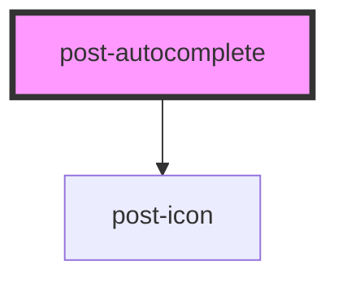

# post-autocomplete

<!-- Auto Generated Below -->

## Properties

| Property               | Attribute          | Description                                                     | Type      | Default     |
| ---------------------- | ------------------ | --------------------------------------------------------------- | --------- | ----------- |
| `clearable`            | `clearable`        | Whether the input shows a clear button when it has a value.     | `boolean` | `false`     |
| `debounceTimeout`      | `debounce-timeout` | Debounce delay in milliseconds for input filtering.             | `number`  | `300`       |
| `filterThreshold`      | `filter-threshold` | Minimum number of characters before filtering begins.           | `number`  | `1`         |
| `options` _(required)_ | `options`          | ID reference pointing to the associated `post-listbox` element. | `string`  | `undefined` |

## Events

| Event               | Description                                                                                                                                                   | Type                              |
| ------------------- | ------------------------------------------------------------------------------------------------------------------------------------------------------------- | --------------------------------- |
| `postChange`        | Fired when the selected value changes.                                                                                                                        | `CustomEvent<{ value: string; }>` |
| `postFilterRequest` | Cancellable event fired before filtering. If `event.preventDefault()` is called, internal filtering is skipped and the consumer handles filtering externally. | `CustomEvent<{ query: string; }>` |
| `postInput`         | Fired on every input keystroke (after debounce).                                                                                                              | `CustomEvent<{ value: string; }>` |

## Methods

### `reset() => Promise<void>`

Clears input, clears selection, resets filter, closes dropdown.

#### Returns

Type: `Promise<void>`

## Slots

| Slot        | Description                                                                                                                              |
| ----------- | ---------------------------------------------------------------------------------------------------------------------------------------- |
| `"default"` | Slot for `<label>`, `<input>`, and optional hint text. The component discovers the slotted `<input>` for ARIA wiring and event handling. |

## Dependencies

### Depends on

- [post-icon](../post-icon)

### Graph

```mermaid
graph TD;
  post-autocomplete --> post-icon
  style post-autocomplete fill:#f9f,stroke:#333,stroke-width:4px
```

----------------------------------------------

*Built with [StencilJS](https://stenciljs.com/)*
