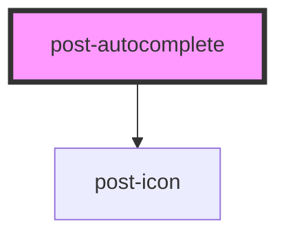

# post-accordion

<!-- Auto Generated Below -->

## Properties

| Property          | Attribute          | Description                                                                        | Type      | Default     |
| ----------------- | ------------------ | ---------------------------------------------------------------------------------- | --------- | ----------- |
| `clearable`       | `clearable`        | Show or hide the clear button                                                      | `boolean` | `false`     |
| `filterThreshold` | `filter-threshold` | Number of characters to type before filtering methods are called                   | `number`  | `0`         |
| `options`         | `options`          | Optional idref to connect the autocomplete with the options dropdown if not nested | `string`  | `undefined` |

## Slots

| Slot        | Description                                         |
| ----------- | --------------------------------------------------- |
| `"default"` | Slot for placing post-autocomplete-item components. |

## Dependencies

### Depends on

- [post-icon](../post-icon)

### Graph

```mermaid
graph TD;
  post-autocomplete --> post-icon
  style post-autocomplete fill:#f9f,stroke:#333,stroke-width:4px
```

----------------------------------------------

*Built with [StencilJS](https://stenciljs.com/)*
