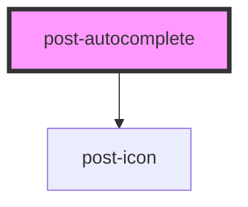

# post-accordion

<!-- Auto Generated Below -->

## Properties

| Property                                | Attribute                    | Description                                                                                                                                                                                                                                                        | Type      | Default     |
| --------------------------------------- | ---------------------------- | ------------------------------------------------------------------------------------------------------------------------------------------------------------------------------------------------------------------------------------------------------------------ | --------- | ----------- |
| `clearable`                             | `clearable`                  | Show or hide the clear button                                                                                                                                                                                                                                      | `boolean` | `false`     |
| `filterThreshold`                       | `filter-threshold`           | Minimum number of characters the user must type before filtering is triggered. Useful when options are loaded asynchronously to avoid unnecessary requests on every keystroke. The `postFilteringEvent` will only fire once the input length meets this threshold. | `number`  | `0`         |
| `listbox`                               | `listbox`                    | Optional idref to connect the autocomplete with the options dropdown if not nested                                                                                                                                                                                 | `string`  | `undefined` |
| `textAvailableSuggestions` _(required)_ | `text-available-suggestions` | Announcement template for screen readers when the suggestion list updates. Use {count} as placeholder for the number of available suggestions, e.g. "{count} suggestions available"                                                                                | `string`  | `undefined` |

## Events

| Event                | Description                                                                                                                                                                                                                                                                      | Type                  |
| -------------------- | -------------------------------------------------------------------------------------------------------------------------------------------------------------------------------------------------------------------------------------------------------------------------------- | --------------------- |
| `postFilteringEvent` | Cancelable event emitted when the input value meets the `filterThreshold` and filtering should occur. Call `event.preventDefault()` to suppress the built-in filtering and handle it yourself, e.g. to fetch options asynchronously based on the query string in `event.detail`. | `CustomEvent<string>` |

## Slots

| Slot        | Description                                         |
| ----------- | --------------------------------------------------- |
| `"default"` | Slot for placing post-autocomplete-item components. |

## Dependencies

### Depends on

- [post-icon](../post-icon)

### Graph

```mermaid
graph TD;
  post-autocomplete --> post-icon
  style post-autocomplete fill:#f9f,stroke:#333,stroke-width:4px
```

----------------------------------------------

*Built with [StencilJS](https://stenciljs.com/)*
