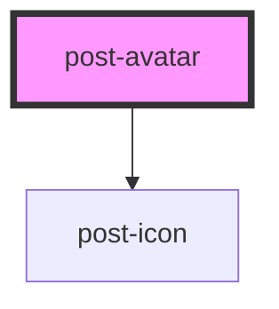

# post-avatar

<!-- Auto Generated Below -->

## Properties

| Property                 | Attribute   | Description                      | Type                 | Default     |
| ------------------------ | ----------- | -------------------------------- | -------------------- | ----------- |
| `email`                  | `email`     | Defines the users email address. | `string`             | `undefined` |
| `firstname` _(required)_ | `firstname` | Defines the users firstname.     | `string`             | `undefined` |
| `lastname`               | `lastname`  | Defines the users lastname.      | `string`             | `undefined` |
| `size`                   | `size`      | Defines the size of the avatar.  | `"large" \| "small"` | `'large'`   |

## Dependencies

### Depends on

- [post-icon](../post-icon)

### Graph

----------------------------------------------

*Built with [StencilJS](https://stenciljs.com/)*
