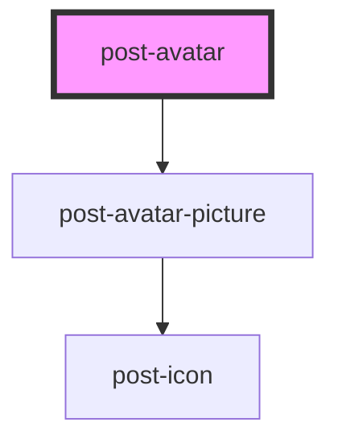

# post-avatar

<!-- Auto Generated Below -->

## Properties

| Property    | Attribute   | Description              | Type                 | Default     |
| ----------- | ----------- | ------------------------ | -------------------- | ----------- |
| `company`   | `company`   | The user's company name  | `string`             | `undefined` |
| `email`     | `email`     | The user's email address | `string`             | `undefined` |
| `firstname` | `firstname` | The user's firstname     | `string`             | `undefined` |
| `lastname`  | `lastname`  | The user's lastname      | `string`             | `undefined` |
| `size`      | `size`      | The size of the avatar   | `"large" \| "small"` | `'large'`   |

## Dependencies

### Depends on

- [post-avatar-picture](../post-avatar-picture)

### Graph

----------------------------------------------

*Built with [StencilJS](https://stenciljs.com/)*
