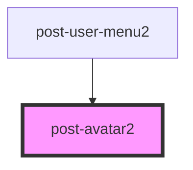

# post-avatar

<!-- Auto Generated Below -->

## Properties

| Property                 | Attribute   | Description                                                                                                                          | Type     | Default     |
| ------------------------ | ----------- | ------------------------------------------------------------------------------------------------------------------------------------ | -------- | ----------- |
| `email`                  | `email`     | Defines the users email address associated with a gravatar profile picture.                                                          | `string` | `undefined` |
| `firstname` _(required)_ | `firstname` | Defines the users firstname.                                                                                                         | `string` | `undefined` |
| `lastname`               | `lastname`  | Defines the users lastname.                                                                                                          | `string` | `undefined` |
| `userid`                 | `userid`    | Defines the company internal userId.
Can only be used on post.ch domains!
 | `string` | `undefined` |

## Slots

| Slot        | Description                                  |
| ----------- | -------------------------------------------- |
| `"default"` | Slot for inserting a custom image as avatar. |

## Dependencies

### Used by

 - [post-user-menu2](../post-user-menu2)

### Graph

----------------------------------------------

*Built with [StencilJS](https://stenciljs.com/)*
