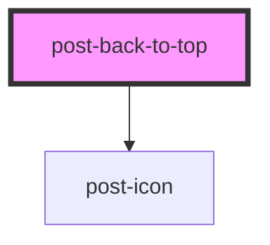

# post-back-to-top

<!-- Auto Generated Below -->

## Properties

| Property    | Attribute   | Description | Type     | Default |
| ----------- | ----------- | ----------- | -------- | ------- |
| `threshold` | `threshold` |             | `number` | `80`    |

## Dependencies

### Depends on

- [post-icon](../post-icon)

### Graph

----------------------------------------------

*Built with [StencilJS](https://stenciljs.com/)*
