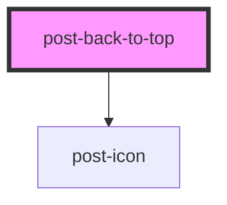

# post-back-to-top

<!-- Auto Generated Below -->

## Properties

| Property             | Attribute | Description                                                                                                             | Type     | Default     |
| -------------------- | --------- | ----------------------------------------------------------------------------------------------------------------------- | -------- | ----------- |
| `label` _(required)_ | `label`   | The label of the back-to-top button, intended solely for accessibility purposes. This label is always hidden from view. | `string` | `undefined` |

## Dependencies

### Depends on

- [post-icon](../post-icon)

### Graph

----------------------------------------------

*Built with [StencilJS](https://stenciljs.com/)*
