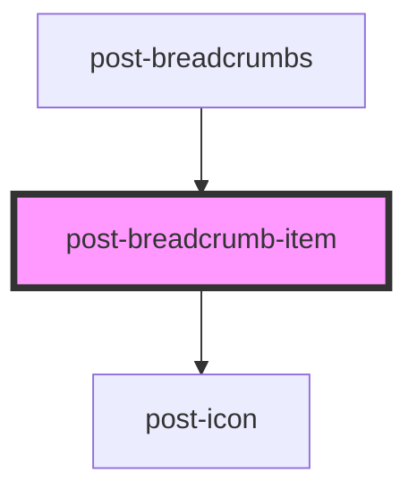

# post-breadcrumb-item

<!-- Auto Generated Below -->

## Properties

| Property      | Attribute     | Description                                                                                 | Type            | Default     |
| ------------- | ------------- | ------------------------------------------------------------------------------------------- | --------------- | ----------- |
| `description` | `description` | ARIA description for additional context, read after the breadcrumb item content or `label`. | `string`        | `undefined` |
| `label`       | `label`       | ARIA label, screen readers will use this instead of the breadcrumb item content.            | `string`        | `undefined` |
| `url`         | `url`         | The optional URL to which the breadcrumb item will link.                                    | `URL \| string` | `undefined` |

## Slots

| Slot        | Description                                           |
| ----------- | ----------------------------------------------------- |
| `"default"` | Slot for placing the text inside the breadcrumb item. |

## Dependencies

### Used by

 - [post-breadcrumbs](../post-breadcrumbs)

### Depends on

- [post-icon](../post-icon)

### Graph

```mermaid
graph TD;
  post-breadcrumb-item --> post-icon
  post-breadcrumbs --> post-breadcrumb-item
  style post-breadcrumb-item fill:#f9f,stroke:#333,stroke-width:4px
```

----------------------------------------------

*Built with [StencilJS](https://stenciljs.com/)*
