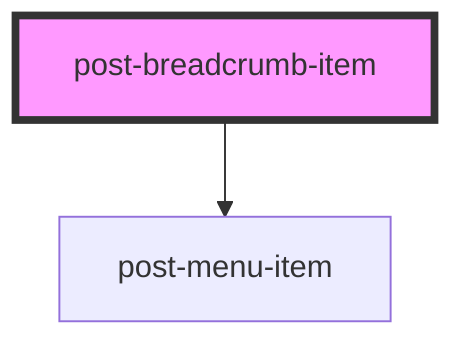

# post-breadcrumb-item

<!-- Auto Generated Below -->

## Properties

| Property   | Attribute  | Description                                                                                            | Type                       | Default      |
| ---------- | ---------- | ------------------------------------------------------------------------------------------------------ | -------------------------- | ------------ |
| `selected` | `selected` | Indicates that the item represents the current page, applying appropriate styling.                     | `boolean`                  | `false`      |
| `url`      | `url`      | The destination URL for the breadcrumb item. If omitted, the item is rendered as non-interactive text. | `URL \| string`            | `undefined`  |
| `variant`  | `variant`  | Controls how the item is rendered, either as a standard list item or within an overflow menu.          | `"listitem" \| "menuitem"` | `'listitem'` |

## Slots

| Slot        | Description                                       |
| ----------- | ------------------------------------------------- |
| `"default"` | The content displayed inside the breadcrumb item. |

## Dependencies

### Depends on

- [post-menu-item](../post-menu-item)

### Graph

```mermaid
graph TD;
  post-breadcrumb-item --> post-menu-item
  style post-breadcrumb-item fill:#f9f,stroke:#333,stroke-width:4px
```

----------------------------------------------

*Built with [StencilJS](https://stenciljs.com/)*
