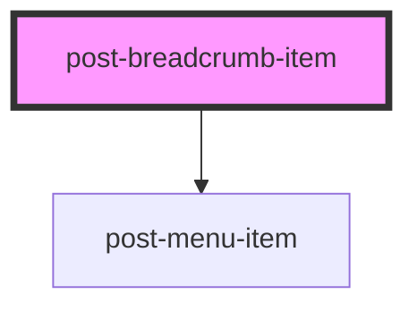

# post-breadcrumb-item

<!-- Auto Generated Below -->

## Properties

| Property   | Attribute  | Description                                                                                         | Type                       | Default      |
| ---------- | ---------- | --------------------------------------------------------------------------------------------------- | -------------------------- | ------------ |
| `selected` | `selected` | Defines whether the component renders as a list item or a menu item.                                | `boolean`                  | `false`      |
| `url`      | `url`      | The link destination for the breadcrumb item. If not provided, the item is rendered without a link. | `URL \| string`            | `undefined`  |
| `variant`  | `variant`  | Defines whether the component renders as a list item or a menu item.                                | `"listitem" \| "menuitem"` | `'listitem'` |

## Slots

| Slot        | Description                                       |
| ----------- | ------------------------------------------------- |
| `"default"` | The content displayed inside the breadcrumb item. |

## Dependencies

### Depends on

- [post-menu-item](../post-menu-item)

### Graph

```mermaid
graph TD;
  post-breadcrumb-item --> post-menu-item
  style post-breadcrumb-item fill:#f9f,stroke:#333,stroke-width:4px
```

----------------------------------------------

*Built with [StencilJS](https://stenciljs.com/)*
