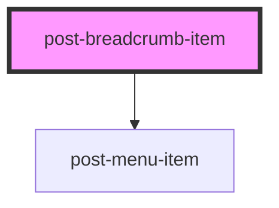

# post-breadcrumb-item

<!-- Auto Generated Below -->

## Properties

| Property      | Attribute     | Description                                                                                                                                                | Type                       | Default      |
| ------------- | ------------- | ---------------------------------------------------------------------------------------------------------------------------------------------------------- | -------------------------- | ------------ |
| `description` | `description` | An accessible description for additional context, read after the content or `label`.                                                                       | `string`                   | `undefined`  |
| `label`       | `label`       | An accessible label screen readers will use this instead of the breadcrumb item content.                                                                   | `string`                   | `undefined`  |
| `selected`    | `selected`    | Indicates that the item represents the current page, applying appropriate styling.                                                                         | `boolean`                  | `false`      |
| `url`         | `url`         | The destination URL for the breadcrumb item. Ignored if an `<a>` element is slotted in. If both are omitted, the item is rendered as non-interactive text. | `URL \| string`            | `undefined`  |
| `variant`     | `variant`     | Controls how the item is rendered, either as a standard list item or within an overflow menu.                                                              | `"listitem" \| "menuitem"` | `'listitem'` |

## Slots

| Slot        | Description                                                                                                                                                                                        |
| ----------- | -------------------------------------------------------------------------------------------------------------------------------------------------------------------------------------------------- |
| `"default"` | The content displayed inside the breadcrumb item. Can contain text or an <a> element, so consumers can slot their own routing-aware link (e.g. Next.js Link) instead of relying on the `url` prop. |

## Dependencies

### Depends on

- [post-menu-item](../post-menu-item)

### Graph

```mermaid
graph TD;
  post-breadcrumb-item --> post-menu-item
  style post-breadcrumb-item fill:#f9f,stroke:#333,stroke-width:4px
```

----------------------------------------------

*Built with [StencilJS](https://stenciljs.com/)*
