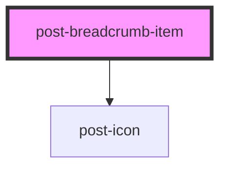

# post-breadcrumb-item

<!-- Auto Generated Below -->

## Properties

| Property | Attribute | Description                                              | Type     | Default     |
| -------- | --------- | -------------------------------------------------------- | -------- | ----------- |
| `url`    | `url`     | The optional URL to which the breadcrumb item will link. | `string` | `undefined` |

## Slots

| Slot        | Description                                           |
| ----------- | ----------------------------------------------------- |
| `"default"` | Slot for placing the text inside the breadcrumb link. |

## Dependencies

### Depends on

- [post-icon](../post-icon)

### Graph

----------------------------------------------

*Built with [StencilJS](https://stenciljs.com/)*
