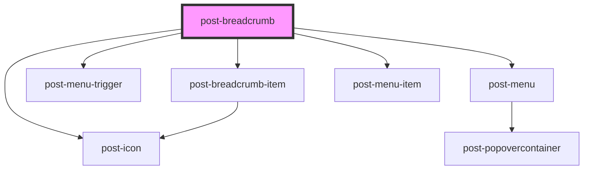

# post-breadcrumbs-new

<!-- Auto Generated Below -->

## Properties

| Property   | Attribute   | Description                       | Type            | Default     |
| ---------- | ----------- | --------------------------------- | --------------- | ----------- |
| `homeText` | `home-text` | Text for the home breadcrumb link | `string`        | `'Home'`    |
| `homeUrl`  | `home-url`  | URL for the home breadcrumb link  | `URL \| string` | `undefined` |

## Dependencies

### Depends on

- [post-icon](../post-icon)
- [post-breadcrumb-item](../post-breadcrumb-item)
- [post-menu-trigger](../post-menu-trigger)
- [post-menu](../post-menu)
- [post-menu-item](../post-menu-item)

### Graph

----------------------------------------------

*Built with [StencilJS](https://stenciljs.com/)*
