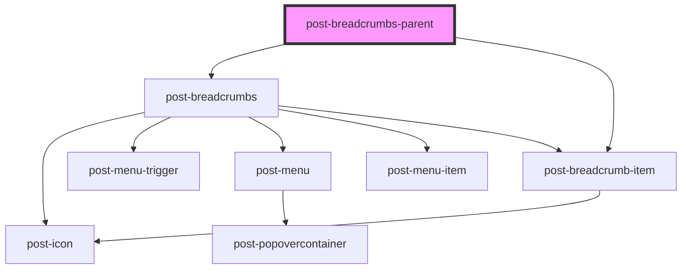

# post-breadcrumbs-parent

<!-- Auto Generated Below -->

## Properties

| Property      | Attribute      | Description                                                                                                                          | Type               | Default     |
| ------------- | -------------- | ------------------------------------------------------------------------------------------------------------------------------------ | ------------------ | ----------- |
| `customItems` | `custom-items` | * Add custom breadcrumb items to the end of the pre-configured list. Handy if your online service has it's own navigation structure. | `Link[] \| string` | `undefined` |

## Dependencies

### Depends on

- [post-breadcrumbs](../post-breadcrumbs)
- [post-breadcrumb-item](../post-breadcrumb-item)

### Graph

----------------------------------------------

*Built with [StencilJS](https://stenciljs.com/)*
