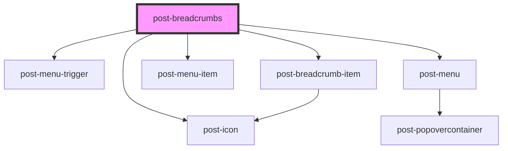

# post-breadcrumbs-new

<!-- Auto Generated Below -->

## Properties

| Property               | Attribute    | Description                                                               | Type     | Default                   |
| ---------------------- | ------------ | ------------------------------------------------------------------------- | -------- | ------------------------- |
| `homeText`             | `home-text`  | The text label for the home breadcrumb item.                              | `string` | `'Home'`                  |
| `homeUrl` _(required)_ | `home-url`   | The URL for the home breadcrumb item.                                     | `string` | `undefined`               |
| `menuLabel`            | `menu-label` | The accessible label for the breadcrumb menu when items are concatenated. | `string` | `'More breadcrumb items'` |

## Dependencies

### Depends on

- [post-icon](../post-icon)
- [post-menu-trigger](../post-menu-trigger)
- [post-menu](../post-menu)
- [post-menu-item](../post-menu-item)
- [post-breadcrumb-item](../post-breadcrumb-item)

### Graph

----------------------------------------------

*Built with [StencilJS](https://stenciljs.com/)*
