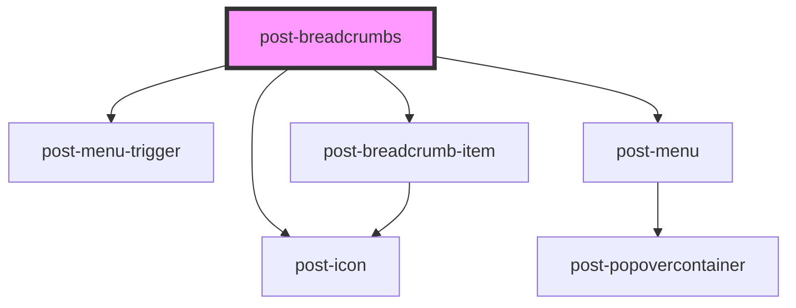

# post-breadcrumbs-new

<!-- Auto Generated Below -->

## Properties

| Property                       | Attribute          | Description                                                                          | Type     | Default     |
| ------------------------------ | ------------------ | ------------------------------------------------------------------------------------ | -------- | ----------- |
| `homeUrl` _(required)_         | `home-url`         | The URL for the home breadcrumb item.                                                | `string` | `undefined` |
| `textBreadcrumbs` _(required)_ | `text-breadcrumbs` | The accessible label for the breadcrumb component.                                   | `string` | `undefined` |
| `textHome` _(required)_        | `text-home`        | The text label for the home breadcrumb item.                                         | `string` | `undefined` |
| `textMoreItems` _(required)_   | `text-more-items`  | The accessible label for the breadcrumb menu when breadcrumb items are concatenated. | `string` | `undefined` |

## Dependencies

### Depends on

- [post-icon](../post-icon)
- [post-menu-trigger](../post-menu-trigger)
- [post-menu](../post-menu)
- [post-breadcrumb-item](../post-breadcrumb-item)

### Graph

----------------------------------------------

*Built with [StencilJS](https://stenciljs.com/)*
