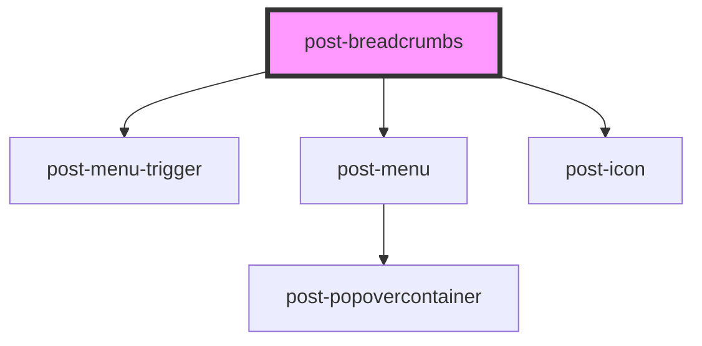

# post-breadcrumbs-new

<!-- Auto Generated Below -->

## Properties

| Property                       | Attribute          | Description                                                                         | Type     | Default     |
| ------------------------------ | ------------------ | ----------------------------------------------------------------------------------- | -------- | ----------- |
| `homeUrl` _(required)_         | `home-url`         | The URL for the root (home) breadcrumb item.                                        | `string` | `undefined` |
| `textBreadcrumbs` _(required)_ | `text-breadcrumbs` | An accessible label for the breadcrumb navigation.                                  | `string` | `undefined` |
| `textHome` _(required)_        | `text-home`        | An accessible label for the root (home) breadcrumb item.                            | `string` | `undefined` |
| `textMoreItems` _(required)_   | `text-more-items`  | An accessible label for the overflow menu that contains collapsed breadcrumb items. | `string` | `undefined` |

## Dependencies

### Depends on

- [post-menu-trigger](../post-menu-trigger)
- [post-menu](../post-menu)
- [post-icon](../post-icon)

### Graph

```mermaid
graph TD;
  post-breadcrumbs --> post-menu-trigger
  post-breadcrumbs --> post-menu
  post-breadcrumbs --> post-icon
  post-menu --> post-popovercontainer
  style post-breadcrumbs fill:#f9f,stroke:#333,stroke-width:4px
```

----------------------------------------------

*Built with [StencilJS](https://stenciljs.com/)*
