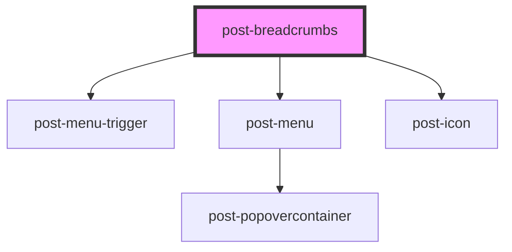

# post-breadcrumbs-new

<!-- Auto Generated Below -->

## Properties

| Property                       | Attribute          | Description                                                                                                                                                | Type      | Default     |
| ------------------------------ | ------------------ | ---------------------------------------------------------------------------------------------------------------------------------------------------------- | --------- | ----------- |
| `homeText`                     | `home-text`        | Whether `text-home` is displayed visibly instead of the home icon, enabling segment specific breadcrumbs (like "Private customers" or "About us").         | `boolean` | `false`     |
| `homeUrl`                      | `home-url`         | The URL for the root (home) breadcrumb item.                                                                                                               | `string`  | `undefined` |
| `textBreadcrumbs` _(required)_ | `text-breadcrumbs` | An accessible label for the breadcrumb navigation.                                                                                                         | `string`  | `undefined` |
| `textHome` _(required)_        | `text-home`        | The label of the root (home) breadcrumb item. Displayed visibly when `home-text` is `true`, otherwise used as an accessible label alongside the home icon. | `string`  | `undefined` |
| `textMoreItems` _(required)_   | `text-more-items`  | An accessible label for the overflow menu that contains collapsed breadcrumb items.                                                                        | `string`  | `undefined` |

## Slots

| Slot     | Description                                                                                                                                                                 |
| -------- | --------------------------------------------------------------------------------------------------------------------------------------------------------------------------- |
| `"home"` | The content of the root (home) breadcrumb item. Can contain an `<a>` element, so consumers can slot their own routing-aware link instead of relying on the `home-url` prop. |

## Dependencies

### Depends on

- [post-menu-trigger](../post-menu-trigger)
- [post-menu](../post-menu)
- [post-icon](../post-icon)

### Graph

```mermaid
graph TD;
  post-breadcrumbs --> post-menu-trigger
  post-breadcrumbs --> post-menu
  post-breadcrumbs --> post-icon
  post-menu --> post-popovercontainer
  style post-breadcrumbs fill:#f9f,stroke:#333,stroke-width:4px
```

----------------------------------------------

*Built with [StencilJS](https://stenciljs.com/)*
