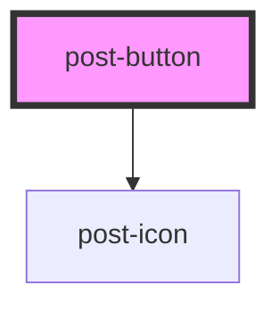

# post-button

<!-- Auto Generated Below -->

## Properties

| Property              | Attribute             | Description                                                                                                                                                                                                                                                                        | Type                              | Default       |
| --------------------- | --------------------- | ---------------------------------------------------------------------------------------------------------------------------------------------------------------------------------------------------------------------------------------------------------------------------------- | --------------------------------- | ------------- |
| `animated`            | `animated`            | Defines if the button should have an animation.                                                                                                                                                                                                                                    | `"end" \| "start"`                | `null`        |
| `autofocus`           | `autofocus`           | Defines if the button should be focused on the first render.                                                                                                                                                                                                                       | `boolean`                         | `undefined`   |
| `disabled`            | `disabled`            | Defines if the button is disabled.                                                                                                                                                                                                                                                 | `boolean`                         | `undefined`   |
| `form`                | `form`                | Defines the form the button belongs to.                                                                                                                                                                                                                                            | `string`                          | `null`        |
| `formaction`          | `formaction`          | Defines the URL the form is submitted to.                                                                                                                                                                                                                                          | `string`                          | `null`        |
| `formenctype`         | `formenctype`         | Defines the encoding type for the form.                                                                                                                                                                                                                                            | `string`                          | `null`        |
| `formmethod`          | `formmethod`          | Defines the HTTP method for the form.                                                                                                                                                                                                                                              | `string`                          | `null`        |
| `formnovalidate`      | `formnovalidate`      | Defines if the form should be validated when submitted.                                                                                                                                                                                                                            | `boolean`                         | `undefined`   |
| `formtarget`          | `formtarget`          | Defines where to display the response after submitting the form.                                                                                                                                                                                                                   | `string`                          | `null`        |
| `icon`                | `icon`                | Defines the icon `name` inside of the component. If not set the icon will not show up. To learn which icons are available, please visit our <a href="/?path=/docs/5704bdc4-c5b5-45e6-b123-c54d01fce2f1--docs">icon library</a>. | `string`                          | `null`        |
| `iconOnly`            | `icon-only`           | Defines if the button should only display the icon. The slot content will be placed in a visually hidden span.                                                                                                                                                                     | `boolean`                         | `undefined`   |
| `iconPosition`        | `icon-position`       | Defines where icon and loading spinner should be placed.                                                                                                                                                                                                                           | `"end" \| "start"`                | `null`        |
| `loading`             | `loading`             | Defines if the button is in a loading state. Icon will be replaced by a loading spinner and the button will be disabled.                                                                                                                                                           | `boolean`                         | `undefined`   |
| `name`                | `name`                | Defines the name of the button.                                                                                                                                                                                                                                                    | `string`                          | `null`        |
| `popovertarget`       | `popovertarget`       | Defines the target of the popover.                                                                                                                                                                                                                                                 | `string`                          | `null`        |
| `popovertargetaction` | `popovertargetaction` | Defines the action of the popover target.                                                                                                                                                                                                                                          | `string`                          | `null`        |
| `size`                | `size`                | Defines the size of the component.                                                                                                                                                                                                                                                 | `"lg" \| "md" \| "rg" \| "sm"`    | `'md'`        |
| `type`                | `type`                | Defines the type of the button.                                                                                                                                                                                                                                                    | `"button" \| "reset" \| "submit"` | `null`        |
| `value`               | `value`               | Defines the value of the button.                                                                                                                                                                                                                                                   | `string`                          | `null`        |
| `variant`             | `variant`             | Defines the variant of the component.                                                                                                                                                                                                                                              | `string`                          | `'secondary'` |

## Slots

| Slot        | Description                                                                                                                                                         |
| ----------- | ------------------------------------------------------------------------------------------------------------------------------------------------------------------- |
| `"default"` | Content to place in the `default` slot.
Markup accepted: <a href="https://developer.mozilla.org/en-US/docs/Glossary/Inline-level_content">inline content</a>.
 |

## Dependencies

### Depends on

- [post-icon](../post-icon)

### Graph

----------------------------------------------

*Built with [StencilJS](https://stenciljs.com/)*
