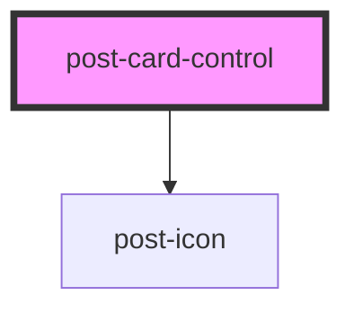

# post-card-control

<!-- Auto Generated Below -->

## Properties

| Property  | Attribute | Description                                      | Type     | Default      |
| --------- | --------- | ------------------------------------------------ | -------- | ------------ |
| `inputid` | `inputid` | Defines the `id` of the input inside the card.   | `string` | `''`         |
| `type`    | `type`    | Defines the `type` of the input inside the card. | `string` | `'checkbox'` |

## Dependencies

### Depends on

- [post-icon](../post-icon)

### Graph

----------------------------------------------

*Built with [StencilJS](https://stenciljs.com/)*
