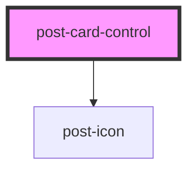

# post-card-control

<!-- Auto Generated Below -->

## Properties

| Property             | Attribute     | Description                                                                                                                                                | Type                    | Default     |
| -------------------- | ------------- | ---------------------------------------------------------------------------------------------------------------------------------------------------------- | ----------------------- | ----------- |
| `checked`            | `checked`     | Defines the `checked` attribute of the control. If `true`, the control is selected.                                                                        | `boolean`               | `false`     |
| `description`        | `description` | Defines the description in the control-label.                                                                                                              | `string`                | `null`      |
| `disabled`           | `disabled`    | Defines the `disabled` attribute of the control. If `true`, the user can not interact with the control.                                                    | `boolean`               | `false`     |
| `icon`               | `icon`        | Defines the icon `name` inside of the card. If not set the icon will not show up.                       | `string`                | `null`      |
| `label` _(required)_ | `label`       | Defines the text in the control-label.                                                                                                                     | `string`                | `undefined` |
| `name`               | `name`        | Defines the `name` attribute of the control, which is submitted with the form data.                                                                        | `string`                | `null`      |
| `state`              | `state`       | Defines the validation `state` of the control.
Only styles for the invalid state have been defined so far.
 | `"false" \| "true"`     | `null`      |
| `type` _(required)_  | `type`        | Defines the `type` attribute of the control.                                                                                                               | `"checkbox" \| "radio"` | `undefined` |
| `value`              | `value`       | Defines the `value` attribute of the control. This is only used, when the control participates in the native `form`.                                       | `string`                | `null`      |

## Events

| Event           | Description                                                                                                                | Type                   |
| --------------- | -------------------------------------------------------------------------------------------------------------------------- | ---------------------- |
| `controlChange` | An event emitted whenever the control value changes. The payload contains the current checked state under `event.details`. | `CustomEvent<boolean>` |

## Dependencies

### Depends on

- [post-icon](../post-icon)

### Graph

----------------------------------------------

*Built with [StencilJS](https://stenciljs.com/)*
