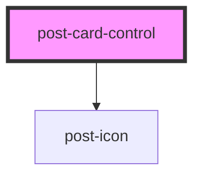

# post-card-control

<!-- Auto Generated Below -->

## Properties

| Property                 | Attribute     | Description                                                                       | Type      | Default      |
| ------------------------ | ------------- | --------------------------------------------------------------------------------- | --------- | ------------ |
| `checked`                | `checked`     | Defines the `checked` attribute of the control.                                   | `boolean` | `false`      |
| `controlId` _(required)_ | `control-id`  | Defines the `id` attribute of the control.                                        | `string`  | `undefined`  |
| `description`            | `description` | Defines the description in the control-label.                                     | `string`  | `undefined`  |
| `disabled`               | `disabled`    | Defines the `disabled` attribute of the control.                                  | `boolean` | `false`      |
| `form`                   | `form`        | Defines the `form` attribute of the control.                                      | `string`  | `undefined`  |
| `icon`                   | `icon`        | Defines the icon `name` inside of the card. If not set the icon will not show up. | `string`  | `undefined`  |
| `label` _(required)_     | `label`       | Defines the text in the control-label.                                            | `string`  | `undefined`  |
| `name`                   | `name`        | Defines the `name` attribute of the control.                                      | `string`  | `undefined`  |
| `required`               | `required`    | Defines the `required` attribute of the control.                                  | `boolean` | `false`      |
| `state`                  | `state`       | Defines the validation `state` of the control.                                    | `boolean` | `null`       |
| `type`                   | `type`        | Defines the `type` attribute of the control.                                      | `string`  | `'checkbox'` |
| `value`                  | `value`       | Defines the `value` attribute of the control.                                     | `string`  | `undefined`  |

## Dependencies

### Depends on

- [post-icon](../post-icon)

### Graph

----------------------------------------------

*Built with [StencilJS](https://stenciljs.com/)*
