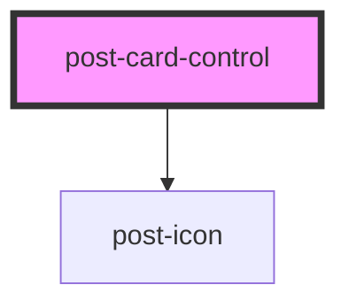

# post-card-control

<!-- Auto Generated Below -->

## Properties

| Property                 | Attribute     | Description                                                                                                                                            | Type                    | Default     |
| ------------------------ | ------------- | ------------------------------------------------------------------------------------------------------------------------------------------------------ | ----------------------- | ----------- |
| `checked`                | `checked`     | Defines the `checked` attribute of the control.                                                                                                        | `boolean`               | `false`     |
| `controlId` _(required)_ | `control-id`  | Defines the `id` attribute of the control. Make sure, the `id` is unique in the entire document. | `string`                | `undefined` |
| `description`            | `description` | Defines the description in the control-label.                                                                                                          | `string`                | `null`      |
| `disabled`               | `disabled`    | Defines the `disabled` attribute of the control.                                                                                                       | `boolean`               | `false`     |
| `form`                   | `form`        | Defines the `form` attribute of the control.                                                                                                           | `string`                | `null`      |
| `icon`                   | `icon`        | Defines the icon `name` inside of the card. If not set the icon will not show up.                   | `string`                | `null`      |
| `label` _(required)_     | `label`       | Defines the text in the control-label.                                                                                                                 | `string`                | `undefined` |
| `name`                   | `name`        | Defines the `name` attribute of the control.                                                                                                           | `string`                | `null`      |
| `state`                  | `state`       | Defines the validation `state` of the control.                                                                                                         | `boolean`               | `null`      |
| `type` _(required)_      | `type`        | Defines the `type` attribute of the control.                                                                                                           | `"checkbox" \| "radio"` | `undefined` |
| `value`                  | `value`       | Defines the `value` attribute of the control.                                                                                                          | `string`                | `null`      |

## Events

| Event           | Description                                                                                                                | Type                   |
| --------------- | -------------------------------------------------------------------------------------------------------------------------- | ---------------------- |
| `controlChange` | An event emitted whenever the control value changes. The payload contains the current checked state under `event.details`. | `CustomEvent<boolean>` |

## Dependencies

### Depends on

- [post-icon](../post-icon)

### Graph

----------------------------------------------

*Built with [StencilJS](https://stenciljs.com/)*
