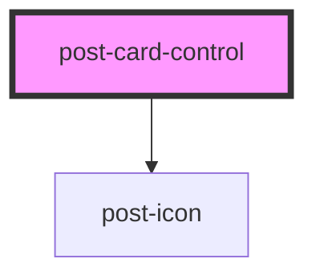

# post-card-control

<!-- Auto Generated Below -->

## Properties

| Property             | Attribute     | Description                                                                                                                                                                                                                                                                                                                                                                                | Type                    | Default     |
| -------------------- | ------------- | ------------------------------------------------------------------------------------------------------------------------------------------------------------------------------------------------------------------------------------------------------------------------------------------------------------------------------------------------------------------------------------------ | ----------------------- | ----------- |
| `checked`            | `checked`     | Defines the `checked` attribute of the control. If `true`, the control is selected at its value will be included in the forms' data.                                                                                                                                                                                                                                                       | `boolean`               | `false`     |
| `description`        | `description` | Defines the description in the control-label.                                                                                                                                                                                                                                                                                                                                              | `string`                | `null`      |
| `disabled`           | `disabled`    | Defines the `disabled` attribute of the control. If `true`, the user can not interact with the control and the controls value will not be included in the forms' data.                                                                                                                                                                                                                     | `boolean`               | `false`     |
| `icon`               | `icon`        | Defines the icon `name` inside the card. If not set the icon will not show up.                                                                                                                                                                                                                                                          | `string`                | `null`      |
| `label` _(required)_ | `label`       | Defines the text in the control-label.                                                                                                                                                                                                                                                                                                                                                     | `string`                | `undefined` |
| `name`               | `name`        | Defines the `name` attribute of the control. This is a required property, when the control should participate in a native `form`. If not specified, a native `form` will never contain this controls value. This is a required property, when the control is used with type `radio`. | `string`                | `null`      |
| `type` _(required)_  | `type`        | Defines the `type` attribute of the control.                                                                                                                                                                                                                                                                                                                                               | `"checkbox" \| "radio"` | `undefined` |
| `validity`           | `validity`    | Defines the validation `validity` of the control. To reset validity to an undefined state, simply remove the attribute from the control.                                                                                                                                                                                                                                                   | `"false" \| "true"`     | `null`      |
| `value`              | `value`       | Defines the `value` attribute of the control. This is a required property, when the control is used with type `radio`.                                                                                                                                                                                                                  | `string`                | `null`      |

## Events

| Event        | Description                                                                                                                                                                                                                                                                                                                                                                        | Type                                              |
| ------------ | ---------------------------------------------------------------------------------------------------------------------------------------------------------------------------------------------------------------------------------------------------------------------------------------------------------------------------------------------------------------------------------- | ------------------------------------------------- |
| `postChange` | An event emitted whenever the components checked state is toggled. The event payload (emitted under `event.detail.state`) is a boolean: `true` if the component is checked, `false` if it is unchecked. If the component is used with type `radio`, it will only emit this event, when the checked state is changing to `true`. | `CustomEvent<{ state: boolean; value: string; }>` |
| `postInput`  | An event emitted whenever the components checked state is toggled. The event payload (emitted under `event.detail.state`) is a boolean: `true` if the component is checked, `false` if it is unchecked.                                                                                                                                                                            | `CustomEvent<{ state: boolean; value: string; }>` |

## Methods

### `groupReset() => Promise<void>`

A hidden public method to reset the group controls `checked` state to `false`.

#### Returns

Type: `Promise<void>`

### `reset() => Promise<void>`

A public method to reset the controls `checked` and `validity` state.
The validity state is set to `null`, so it's neither valid nor invalid.

#### Returns

Type: `Promise<void>`

## Slots

| Slot        | Description                                                                                                                                                                                                                                                                                                                                                                                                                                                                                                                                                                                                                                                                                                                                                                                          |
| ----------- | ---------------------------------------------------------------------------------------------------------------------------------------------------------------------------------------------------------------------------------------------------------------------------------------------------------------------------------------------------------------------------------------------------------------------------------------------------------------------------------------------------------------------------------------------------------------------------------------------------------------------------------------------------------------------------------------------------------------------------------------------------------------------------------------------------- |
| `"default"` | Content to place into the `default` slot.
Markup accepted: <a href="https://developer.mozilla.org/en-US/docs/Glossary/Block-level_contentt">block content</a>.
Even if it is generally possible, we do not recommend using interactive elements in this slot because the background of the card control is clickable. This can lead to confusion when the hit box of nested interactive controls is not clearly separated from the background, is invalid HTML and click events bubbling up to the card control will unexpectedly toggle it if they're not captured. More info: <a href="https://accessibilityinsights.io/info-examples/web/nested-interactive/">https://accessibilityinsights.io/info-examples/web/nested-interactive/</a>
 |
| `"icon"`    | To insert a custom icon into the named `icon` slot.
Markup accepted: <a href="https://developer.mozilla.org/en-US/docs/Glossary/Inline-level_content">inline content</a>.
It is only meant for <code>img</code> or <code>svg</code> elements and overrides the `icon` property.
                                                                                                                                                                                                                                                                                                                                                                                                                                                                        |

## Dependencies

### Depends on

- [post-icon](../post-icon)

### Graph

----------------------------------------------

*Built with [StencilJS](https://stenciljs.com/)*
