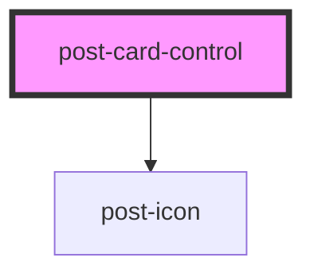

# post-card-control

<!-- Auto Generated Below -->

## Properties

| Property             | Attribute     | Description                                                                                                                                                                                    | Type                    | Default     |
| -------------------- | ------------- | ---------------------------------------------------------------------------------------------------------------------------------------------------------------------------------------------- | ----------------------- | ----------- |
| `checked`            | `checked`     | Defines the `checked` attribute of the control. If `true`, the control is selected at its value will be included in the forms data.                                                            | `boolean`               | `false`     |
| `description`        | `description` | Defines the description in the control-label.                                                                                                                                                  | `string`                | `null`      |
| `disabled`           | `disabled`    | Defines the `disabled` attribute of the control. If `true`, the user can not interact with the control and the controls value will not be included in the forms data.                          | `boolean`               | `false`     |
| `icon`               | `icon`        | Defines the icon `name` inside of the card. If not set the icon will not show up.                                                           | `string`                | `null`      |
| `label` _(required)_ | `label`       | Defines the text in the control-label.                                                                                                                                                         | `string`                | `undefined` |
| `name`               | `name`        | Defines the `name` attribute of the control. This name is used in a forms data to store the given value of the control. If no name is specified a form will never contain this controls value. | `string`                | `null`      |
| `type` _(required)_  | `type`        | Defines the `type` attribute of the control.                                                                                                                                                   | `"checkbox" \| "radio"` | `undefined` |
| `validity`           | `validity`    | Defines the validation `validity` of the control.                                                                                                                                              | `"false" \| "true"`     | `null`      |
| `value`              | `value`       | Defines the `value` attribute of the control. This is only used, when the control participates in the native `form`.                                                                           | `string`                | `null`      |

## Slots

| Slot                 | Description                                                                                                                                                                                                                                                                                     |
| -------------------- | ----------------------------------------------------------------------------------------------------------------------------------------------------------------------------------------------------------------------------------------------------------------------------------------------- |
| `"icon"`             | Content to place in the named `icon` slot.
Markup accepted: <a href="https://developer.mozilla.org/en-US/docs/Glossary/Inline-level_content" target="_blank">inline content</a>. It is only meant for <code>img</code> or <code>svg</code> elements and overrides the `icon` property.
 |
| `"invalid-feedback"` | Content to place in the named `invalid-feedback` slot.
Markup accepted: <a href="https://developer.mozilla.org/en-US/docs/Glossary/Inline-level_content" target="_blank">inline content</a>.
                                                                                              |

## Dependencies

### Depends on

- [post-icon](../post-icon)

### Graph

----------------------------------------------

*Built with [StencilJS](https://stenciljs.com/)*
