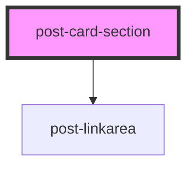

# post-card

<!-- Auto Generated Below -->

## Properties

| Property  | Attribute | Description               | Type                                              | Default     |
| --------- | --------- | ------------------------- | ------------------------------------------------- | ----------- |
| `palette` | `palette` | Palette to use on section | `"accent" \| "alternate" \| "brand" \| "default"` | `'default'` |

## Slots

| Slot        | Description          |
| ----------- | -------------------- |
| `"default"` | Slot for the section |

## Dependencies

### Depends on

- [post-linkarea](../post-linkarea)

### Graph

----------------------------------------------

*Built with [StencilJS](https://stenciljs.com/)*
