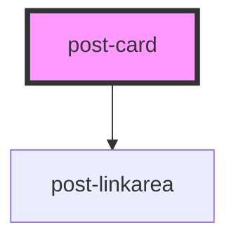

# post-card

<!-- Auto Generated Below -->

## Properties

| Property      | Attribute      | Description         | Type                                        | Default     |
| ------------- | -------------- | ------------------- | ------------------------------------------- | ----------- |
| `imgPosition` | `img-position` | Image position      | `"bottom" \| "top"`                         | `'top'`     |
| `imgSrc`      | `img-src`      | Image source        | `string`                                    | `undefined` |
| `variant`     | `variant`      | Variant of the card | `"card" \| "card-product" \| "card-teaser"` | `'card'`    |

## Slots

| Slot        | Description                   |
| ----------- | ----------------------------- |
| `"default"` | Slot for the body of the card |
| `"footer"`  | Slot for the card footer      |
| `"header"`  | Slot for the card header      |

## Dependencies

### Depends on

- [post-linkarea](../post-linkarea)

### Graph

----------------------------------------------

*Built with [StencilJS](https://stenciljs.com/)*
