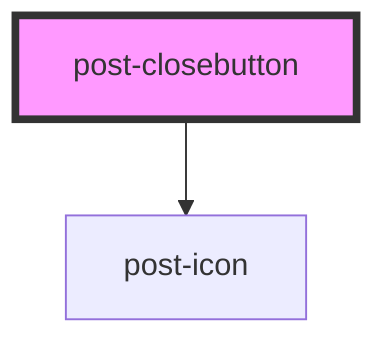

# post-closebutton

<!-- Auto Generated Below -->

## Properties

| Property | Attribute | Description                                 | Type     | Default          |
| -------- | --------- | ------------------------------------------- | -------- | ---------------- |
| `label`  | `label`   | The a11y label to use for the close button. | `string` | `'Close button'` |

## Slots

| Slot        | Description                                                                     |
| ----------- | ------------------------------------------------------------------------------- |
| `"default"` | The post-closebutton is a slot in itself to be used easily in other components. |

## Dependencies

### Depends on

- [post-icon](../post-icon)

### Graph

----------------------------------------------

*Built with [StencilJS](https://stenciljs.com/)*
