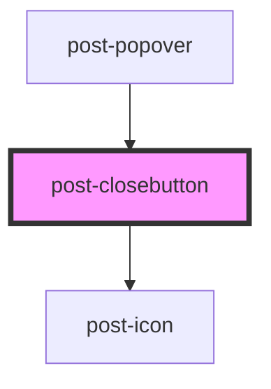

# post-closebutton

<!-- Auto Generated Below -->

## Properties

| Property     | Attribute     | Description                                             | Type                              | Default    |
| ------------ | ------------- | ------------------------------------------------------- | --------------------------------- | ---------- |
| `buttonType` | `button-type` | Overrides the close button's type ("button" by default) | `"button" \| "reset" \| "submit"` | `'button'` |

## Slots

| Slot        | Description                                                 |
| ----------- | ----------------------------------------------------------- |
| `"default"` | Slot for placing visually hidden label in the close button. |

## Dependencies

### Used by

 - [post-popover](../post-popover)

### Depends on

- [post-icon](../post-icon)

### Graph

----------------------------------------------

*Built with [StencilJS](https://stenciljs.com/)*
