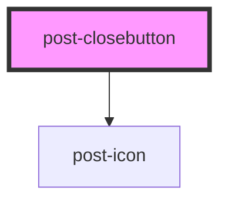

# post-closebutton

<!-- Auto Generated Below -->

## Events

| Event       | Description                                                           | Type                |
| ----------- | --------------------------------------------------------------------- | ------------------- |
| `click` | An event emitted when the close button is clicked. It has no payload. | `CustomEvent<void>` |

## Slots

| Slot        | Description                                                 |
| ----------- | ----------------------------------------------------------- |
| `"default"` | Slot for placing visually hidden label in the close button. |

## Dependencies

### Depends on

- [post-icon](../post-icon)

### Graph

----------------------------------------------

*Built with [StencilJS](https://stenciljs.com/)*
