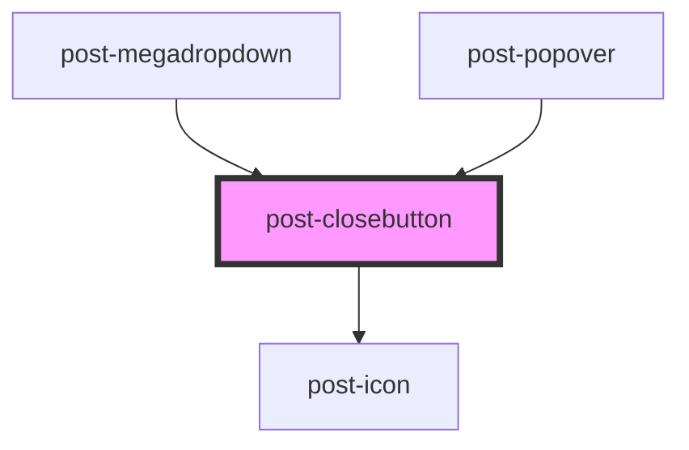

# post-closebutton

<!-- Auto Generated Below -->

## Properties

| Property     | Attribute     | Description                                                                                                            | Type                              | Default     |
| ------------ | ------------- | ---------------------------------------------------------------------------------------------------------------------- | --------------------------------- | ----------- |
| `buttonType` | `button-type` | The "type" attribute used for the close button                                                                         | `"button" \| "reset" \| "submit"` | `'button'`  |
| `placement`  | `placement`   | Defines whether the close button is positioned automatically by the component or left unpositioned for manual styling. | `"auto" \| "manual"`              | `'auto'`    |
| `size`       | `size`        | The size of the close button.                                                                                          | `"default" \| "small"`            | `'default'` |

## Slots

| Slot        | Description                                                 |
| ----------- | ----------------------------------------------------------- |
| `"default"` | Slot for placing visually hidden label in the close button. |

## Dependencies

### Used by

 - [post-megadropdown](../post-megadropdown)
 - [post-popover](../post-popover)

### Depends on

- [post-icon](../post-icon)

### Graph

----------------------------------------------

*Built with [StencilJS](https://stenciljs.com/)*
