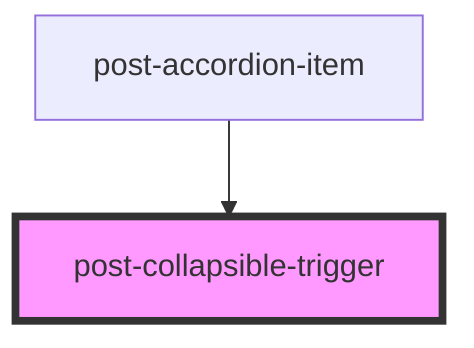

# post-collapsible-trigger

<!-- Auto Generated Below -->

## Properties

| Property | Attribute | Description                                    | Type     | Default     |
| -------- | --------- | ---------------------------------------------- | -------- | ----------- |
| `for`    | `for`     | Link the trigger to a collapsible with this id | `string` | `undefined` |

## Dependencies

### Used by

 - [post-accordion-item](../post-accordion-item)

### Graph

----------------------------------------------

*Built with [StencilJS](https://stenciljs.com/)*
