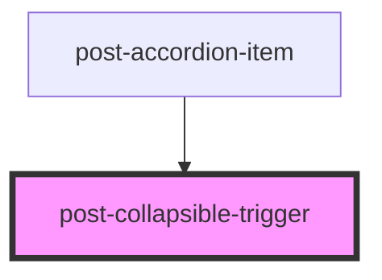

# post-collapsible-trigger

<!-- Auto Generated Below -->

## Properties

| Property | Attribute | Description                                         | Type     | Default     |
| -------- | --------- | --------------------------------------------------- | -------- | ----------- |
| `for`    | `for`     | Link the trigger to a post-collapsible with this id | `string` | `undefined` |

## Methods

### `update() => Promise<void>`

Update the "aria-controls" and "aria-expanded" attributes on the trigger button

#### Returns

Type: `Promise<void>`

## Dependencies

### Used by

 - [post-accordion-item](../post-accordion-item)

### Graph

----------------------------------------------

*Built with [StencilJS](https://stenciljs.com/)*
