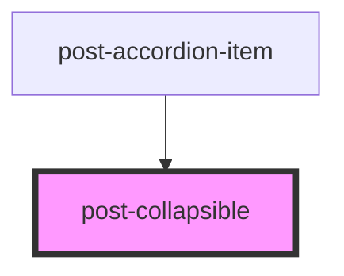

# post-collapsible

<!-- Auto Generated Below -->

## Properties

| Property    | Attribute   | Description                                                    | Type      | Default |
| ----------- | ----------- | -------------------------------------------------------------- | --------- | ------- |
| `collapsed` | `collapsed` | If `true`, the element is collapsed otherwise it is displayed. | `boolean` | `false` |

## Events

| Event        | Description                                                                                                                                                                            | Type                   |
| ------------ | -------------------------------------------------------------------------------------------------------------------------------------------------------------------------------------- | ---------------------- |
| `postToggle` | An event emitted when the collapse element is shown or hidden, before the transition.  The event payload is a boolean: `true` if the collapsible was opened, `false` if it was closed. | `CustomEvent<boolean>` |

## Methods

### `toggle(open?: boolean) => Promise<boolean>`

Triggers the collapse programmatically.

If there is a collapsing transition running already, it will be reversed.

#### Parameters

| Name   | Type      | Description |
| ------ | --------- | ----------- |
| `open` | `boolean` |             |

#### Returns

Type: `Promise<boolean>`

## Slots

| Slot        | Description                                              |
| ----------- | -------------------------------------------------------- |
| `"default"` | Slot for placing content within the collapsible element. |

## Shadow Parts

| Part                      | Description                                                             |
| ------------------------- | ----------------------------------------------------------------------- |
| `"collapsible-container"` | The pseudo-element, used to override styles on the collapsible element. |

## Dependencies

### Used by

 - [post-accordion-item](../post-accordion-item)

### Graph

----------------------------------------------

*Built with [StencilJS](https://stenciljs.com/)*
