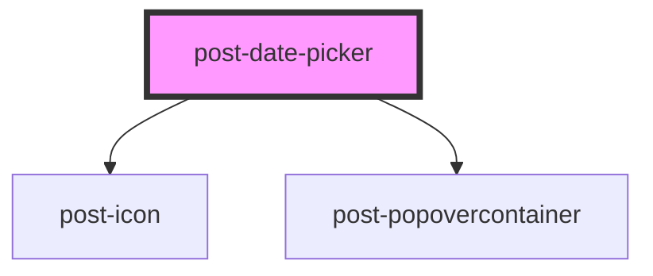

# post-datepicker

<!-- Auto Generated Below -->

## Properties

| Property                          | Attribute              | Description                                                                                                                                                                                                                                                                                              | Type                                                                                                      | Default             |
| --------------------------------- | ---------------------- | -------------------------------------------------------------------------------------------------------------------------------------------------------------------------------------------------------------------------------------------------------------------------------------------------------- | --------------------------------------------------------------------------------------------------------- | ------------------- |
| `cellConfig`                      | --                     | A callback to customize individual calendar cells, e.g. to disable specific dates or add CSS classes.                                                                                                                                                                                                    | `(date: Date, cellType: "day" \| "month" \| "year") => void \| { disabled?: boolean; classes?: string; }` | `undefined`         |
| `inline`                          | `inline`               | Whether the calendar is inline in the page (not showing in a popover when input clicked).                                                                                                                                                                                                                | `boolean`                                                                                                 | `false`             |
| `locale`                          | `locale`               | The date pickers locale (e.g. "it", "it-CH", etc.), which specifies the date format and language. <post-banner type="info" data-size="sm">If not set, it defaults to either the closest ancestor with a `lang` attribute (e.g. \<html lang="de"\>), or falls back to English.</post-banner> | `string`                                                                                                  | `this.systemLocale` |
| `max`                             | `max`                  | Maximum possible date to select. Must be a valid date in ISO 8601 format (YYYY-MM-DD).                                                                                                                                                                                                                   | `string`                                                                                                  | `undefined`         |
| `min`                             | `min`                  | Minimum possible date to select. Must be a valid date in ISO 8601 format (YYYY-MM-DD).                                                                                                                                                                                                                   | `string`                                                                                                  | `undefined`         |
| `range`                           | `range`                | Whether the date picker expects a range selection or a single date selection.                                                                                                                                                                                                                            | `boolean`                                                                                                 | `false`             |
| `textNextDecade` _(required)_     | `text-next-decade`     | Label for "Next decade" button.                                                                                                                                                                                                                                                                          | `string`                                                                                                  | `undefined`         |
| `textNextMonth` _(required)_      | `text-next-month`      | Label for "Next month" button.                                                                                                                                                                                                                                                                           | `string`                                                                                                  | `undefined`         |
| `textNextYear` _(required)_       | `text-next-year`       | Label for "Next year" button.                                                                                                                                                                                                                                                                            | `string`                                                                                                  | `undefined`         |
| `textPreviousDecade` _(required)_ | `text-previous-decade` | Label for "Previous decade" button.                                                                                                                                                                                                                                                                      | `string`                                                                                                  | `undefined`         |
| `textPreviousMonth` _(required)_  | `text-previous-month`  | Label for "Previous month" button.                                                                                                                                                                                                                                                                       | `string`                                                                                                  | `undefined`         |
| `textPreviousYear` _(required)_   | `text-previous-year`   | Label for "Previous year" button.                                                                                                                                                                                                                                                                        | `string`                                                                                                  | `undefined`         |
| `textSwitchYear` _(required)_     | `text-switch-year`     | Label for the "Switch to year view" title button.                                                                                                                                                                                                                                                        | `string`                                                                                                  | `undefined`         |
| `textToggleCalendar`              | `text-toggle-calendar` | Label for the toggle button that opens the calendar. It is only needed when the calendar is not inline.                                                                                                                                                                                                  | `string`                                                                                                  | `undefined`         |

## Methods

### `hide() => Promise<void>`

Hides the popover calendar.

#### Returns

Type: `Promise<void>`

### `show() => Promise<void>`

Displays the popover calendar, focusing the first calendar item.

#### Returns

Type: `Promise<void>`

## Dependencies

### Depends on

- [post-icon](../post-icon)
- [post-popovercontainer](../post-popovercontainer)

### Graph

----------------------------------------------

*Built with [StencilJS](https://stenciljs.com/)*
