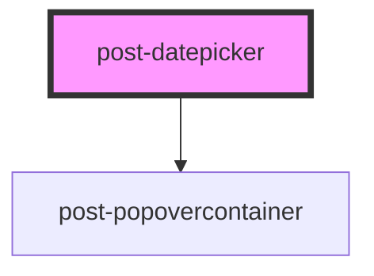

# post-datepicker

<!-- Auto Generated Below -->

## Properties

| Property    | Attribute    | Description                                                                              | Type      | Default      |
| ----------- | ------------ | ---------------------------------------------------------------------------------------- | --------- | ------------ |
| `inline`    | `inline`     | Whether the calendar is inline in the page (not showing in a popover when input clicked) | `boolean` | `false`      |
| `locale`    | `locale`     | Locale prop to set translations                                                          | `string`  | `'en'`       |
| `startDate` | `start-date` | The predefined start date of the calendar Default is today                               | `Date`    | `new Date()` |

## Events

| Event            | Description                                                                                                                                  | Type                   |
| ---------------- | -------------------------------------------------------------------------------------------------------------------------------------------- | ---------------------- |
| `toggleCalendar` | Emits when the calendar is shown or hidden. The event payload is a boolean: `true` when the calendar was opened, `false` when it was closed. | `CustomEvent<boolean>` |

## Methods

### `hide() => Promise<void>`

Hides the popover calendar and restores focus to the previously focused element.

#### Returns

Type: `Promise<void>`

### `show(target: HTMLElement) => Promise<void>`

Displays the popover calendar, focusing the first calendar item.

#### Parameters

| Name     | Type          | Description                                                                    |
| -------- | ------------- | ------------------------------------------------------------------------------ |
| `target` | `HTMLElement` | - The HTML element relative to which the popover calendar should be displayed. |

#### Returns

Type: `Promise<void>`

## Dependencies

### Depends on

- [post-popovercontainer](../post-popovercontainer)

### Graph

----------------------------------------------

*Built with [StencilJS](https://stenciljs.com/)*
