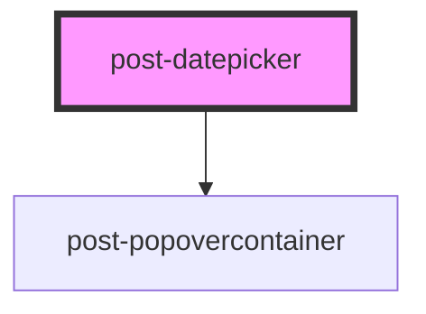

# post-datepicker

<!-- Auto Generated Below -->

## Properties

| Property       | Attribute       | Description                                                                              | Type                       | Default      |
| -------------- | --------------- | ---------------------------------------------------------------------------------------- | -------------------------- | ------------ |
| `disableDates` | `disable-dates` | List of disabled dates Should be set in a string, comma separated                        | `string`                   | `undefined`  |
| `inline`       | `inline`        | Whether the calendar is inline in the page (not showing in a popover when input clicked) | `boolean`                  | `false`      |
| `maxDate`      | `max-date`      | Maximum possible date to select                                                          | `Date \| number \| string` | `undefined`  |
| `minDate`      | `min-date`      | Minimun possible date to select                                                          | `Date \| number \| string` | `undefined`  |
| `range`        | `range`         | Whether the datepicker expects a range selection or a single date selection              | `boolean`                  | `false`      |
| `selectedDate` | `selected-date` | Selected date (or selected date range)                                                   | `Date \| Date[]`           | `undefined`  |
| `startDate`    | `start-date`    | The predefined start date of the calendar Default is today                               | `Date`                     | `new Date()` |

## Events

| Event             | Description                                                         | Type                          |
| ----------------- | ------------------------------------------------------------------- | ----------------------------- |
| `postUpdateDates` | An event emitted when a date or a range of dates have been selected | `CustomEvent<Date \| Date[]>` |

## Methods

### `hide() => Promise<void>`

Hides the popover calendar

#### Returns

Type: `Promise<void>`

### `show(target: HTMLElement) => Promise<void>`

Displays the popover calendar, focusing the first calendar item.

#### Parameters

| Name     | Type          | Description                                                                    |
| -------- | ------------- | ------------------------------------------------------------------------------ |
| `target` | `HTMLElement` | - The HTML element relative to which the popover calendar should be displayed. |

#### Returns

Type: `Promise<void>`

## Dependencies

### Depends on

- [post-popovercontainer](../post-popovercontainer)

### Graph

----------------------------------------------

*Built with [StencilJS](https://stenciljs.com/)*
