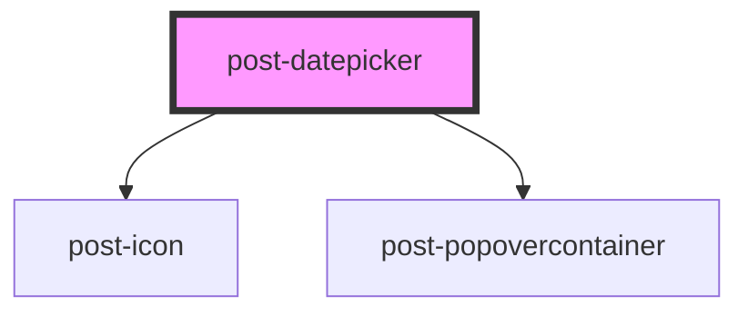

# post-datepicker

<!-- Auto Generated Below -->

## Properties

| Property           | Attribute             | Description                                                                                                                  | Type                                                                                                             | Default      |
| ------------------ | --------------------- | ---------------------------------------------------------------------------------------------------------------------------- | ---------------------------------------------------------------------------------------------------------------- | ------------ |
| `disabledDates`    | `disabled-dates`      | List of fixed disabled dates                                                                                                 | `string \| string[]`                                                                                             | `undefined`  |
| `inline`           | `inline`              | Whether the calendar is inline in the page (not showing in a popover when input clicked)                                     | `boolean`                                                                                                        | `false`      |
| `max`              | `max`                 | Maximum possible date to select                                                                                              | `Date \| number \| string`                                                                                       | `undefined`  |
| `min`              | `min`                 | Minimun possible date to select                                                                                              | `Date \| number \| string`                                                                                       | `undefined`  |
| `onUserRenderCell` | `on-user-render-cell` | Used to extend the existing on render cell to disable an infinite list of dates e.g. all weekends, all months of March, etc. | `(data: { date: Date; cellType: AirDatepickerViewsSingle; datepicker: AirDatepicker<HTMLDivElement>; }) => void` | `undefined`  |
| `range`            | `range`               | Whether the datepicker expects a range selection or a single date selection                                                  | `boolean`                                                                                                        | `false`      |
| `selectedDate`     | `selected-date`       | Selected date (or selected date range)                                                                                       | `[string, string] \| string`                                                                                     | `undefined`  |
| `startDate`        | `start-date`          | The predefined start date of the calendar Default is today                                                                   | `Date`                                                                                                           | `new Date()` |

## Events

| Event             | Description                                                         | Type                          |
| ----------------- | ------------------------------------------------------------------- | ----------------------------- |
| `postUpdateDates` | An event emitted when a date or a range of dates have been selected | `CustomEvent<Date \| Date[]>` |

## Methods

### `hide() => Promise<void>`

Hides the popover calendar

#### Returns

Type: `Promise<void>`

### `show(target: HTMLElement) => Promise<void>`

Displays the popover calendar, focusing the first calendar item.

#### Parameters

| Name     | Type          | Description                                                                    |
| -------- | ------------- | ------------------------------------------------------------------------------ |
| `target` | `HTMLElement` | - The HTML element relative to which the popover calendar should be displayed. |

#### Returns

Type: `Promise<void>`

## Dependencies

### Depends on

- [post-icon](../post-icon)
- [post-popovercontainer](../post-popovercontainer)

### Graph

----------------------------------------------

*Built with [StencilJS](https://stenciljs.com/)*
