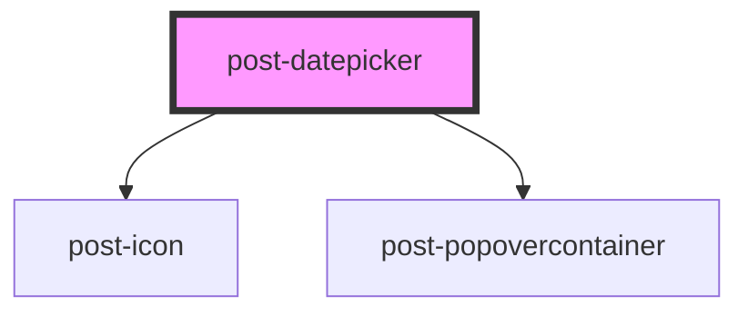

# post-datepicker

<!-- Auto Generated Below -->

## Properties

| Property                           | Attribute               | Description                                                                                         | Type                                                                                                             | Default     |
| ---------------------------------- | ----------------------- | --------------------------------------------------------------------------------------------------- | ---------------------------------------------------------------------------------------------------------------- | ----------- |
| `inline`                           | `inline`                | Whether the calendar is inline in the page (not showing in a popover when input clicked)            | `boolean`                                                                                                        | `false`     |
| `labelNextDecade` _(required)_     | `label-next-decade`     | Label for "Next decade" button                                                                      | `string`                                                                                                         | `undefined` |
| `labelNextMonth` _(required)_      | `label-next-month`      | Label for "Next month" button                                                                       | `string`                                                                                                         | `undefined` |
| `labelNextYear` _(required)_       | `label-next-year`       | Label for "Next year" button                                                                        | `string`                                                                                                         | `undefined` |
| `labelPreviousDecade` _(required)_ | `label-previous-decade` | Label for "Previous decade" button                                                                  | `string`                                                                                                         | `undefined` |
| `labelPreviousMonth` _(required)_  | `label-previous-month`  | Label for "Previous month" button                                                                   | `string`                                                                                                         | `undefined` |
| `labelPreviousYear` _(required)_   | `label-previous-year`   | Label for "Previous year" button                                                                    | `string`                                                                                                         | `undefined` |
| `labelSwitchYear` _(required)_     | `label-switch-year`     | Label for the "Switch to year view" title button                                                    | `string`                                                                                                         | `undefined` |
| `labelToggleCalendar`              | `label-toggle-calendar` | Label for the toggle button that opens the calendar Only needed when calendar is connected to input | `string`                                                                                                         | `undefined` |
| `max`                              | `max`                   | Maximum possible date to select                                                                     | `string`                                                                                                         | `undefined` |
| `min`                              | `min`                   | Minimun possible date to select                                                                     | `string`                                                                                                         | `undefined` |
| `range`                            | `range`                 | Whether the datepicker expects a range selection or a single date selection                         | `boolean`                                                                                                        | `false`     |
| `renderCellCallback`               | `render-cell-callback`  | Used to extend the existing on render cell to disable dates                                         | `(data: { date: Date; cellType: AirDatepickerViewsSingle; datepicker: AirDatepicker<HTMLDivElement>; }) => void` | `undefined` |
| `selectedEndDate`                  | `selected-end-date`     | Selected end date for range datepicker only                                                         | `string`                                                                                                         | `undefined` |
| `selectedStartDate`                | `selected-start-date`   | Selected date If range datepicker: Selected start date                                              | `string`                                                                                                         | `undefined` |

## Events

| Event             | Description                                                         | Type                          |
| ----------------- | ------------------------------------------------------------------- | ----------------------------- |
| `postUpdateDates` | An event emitted when a date or a range of dates have been selected | `CustomEvent<Date \| Date[]>` |

## Methods

### `hide() => Promise<void>`

Hides the popover calendar

#### Returns

Type: `Promise<void>`

### `show(target: HTMLElement) => Promise<void>`

Displays the popover calendar, focusing the first calendar item

#### Parameters

| Name     | Type          | Description                                                                   |
| -------- | ------------- | ----------------------------------------------------------------------------- |
| `target` | `HTMLElement` | - The HTML element relative to which the popover calendar should be displayed |

#### Returns

Type: `Promise<void>`

## Dependencies

### Depends on

- [post-icon](../post-icon)
- [post-popovercontainer](../post-popovercontainer)

### Graph

----------------------------------------------

*Built with [StencilJS](https://stenciljs.com/)*
