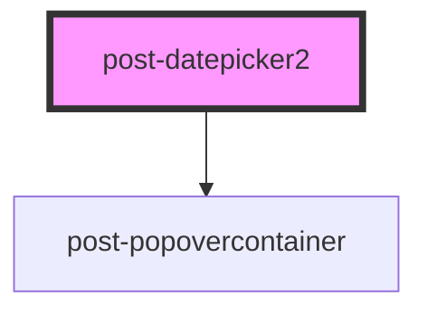

# post-datepicker

<!-- Auto Generated Below -->

## Properties

| Property       | Attribute        | Description                     | Type                                                        | Default     |
| -------------- | ---------------- | ------------------------------- | ----------------------------------------------------------- | ----------- |
| `locale`       | `locale`         | Locale prop to set translations | `string`                                                    | `'en'`      |
| `onRenderCell` | `on-render-cell` | ON render cell                  | `(args: RenderCellArgs) => void \| { disabled?: boolean; }` | `undefined` |

## Events

| Event            | Description                                                                                                                                  | Type                   |
| ---------------- | -------------------------------------------------------------------------------------------------------------------------------------------- | ---------------------- |
| `toggleCalendar` | Emits when the calendar is shown or hidden. The event payload is a boolean: `true` when the calendar was opened, `false` when it was closed. | `CustomEvent<boolean>` |

## Methods

### `getInstance() => Promise<AirDatepicker<HTMLDivElement>>`

#### Returns

Type: `Promise<AirDatepicker<HTMLDivElement>>`

### `hide() => Promise<void>`

Hides the popover calendar and restores focus to the previously focused element.

#### Returns

Type: `Promise<void>`

### `show(target: HTMLElement) => Promise<void>`

Displays the popover calendar, focusing the first calendar item.

#### Parameters

| Name     | Type          | Description                                                                    |
| -------- | ------------- | ------------------------------------------------------------------------------ |
| `target` | `HTMLElement` | - The HTML element relative to which the popover calendar should be displayed. |

#### Returns

Type: `Promise<void>`

## Dependencies

### Depends on

- [post-popovercontainer](../post-popovercontainer)

### Graph

----------------------------------------------

*Built with [StencilJS](https://stenciljs.com/)*
